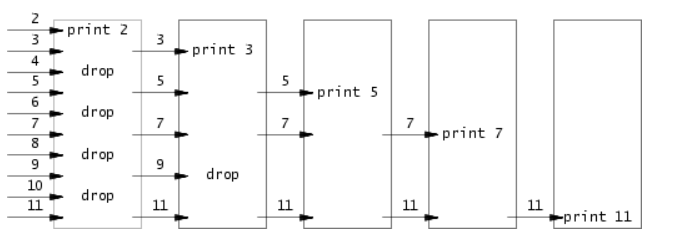

# MIT6.S081
麻省理工2020年秋操作系统实验

写在前面：

这个实验是我在2022年8月2号开始写，到8月16号结束，中间还耽误了一点时间，基本是一天一个。可以说是我写过最简单的实验了。可是，在我的航空母舰计划刚开始的时候，也就是今年的1月
初为了参加os竞赛，做学校的os实验，是拿xv6的util、syscall、lock和pgtbl这四个实验，那会写是特别吃力，在潘延麒学长帮助下，还没有完全完成。现在我正在提笔，哦不，提键盘写xv6实
验的思路与过程，感慨万分，想把这近一年的学习路程，或者感想写一下。

从去年10月份自学计组、计网、os、编译原理、x86汇编，那会自学还是看b站国内网课，直到后面我才发现国外的网课基本上都是远高于国内的质量，教材也是如此（非崇洋媚外，通过实践对比得
出结论），我一开始看的是计组，是b哈工大刘宏伟老师的课，教材是唐书。学完花了一个月，一开始我觉得课和教材都特别好，但是后面我了解到伯克利的cs61c，看了计算机组成与设计黑书，我
才发现前者和后者对比，那完全不行，个人感觉前者垃圾的一批。对于网课，前者没有涉及到计算机体系架构，应该是略微涉及到x86，而后者是riscv，而且前者还有好多关键内容没有讲到，像
mmu、tlb、trap处理、还有cpu的架构，这最重要的东西，前者没有重点涉及，而后者一应俱全，并且这些都很详细，像mmu、tlb等，这些可以说是计算机组成与os接口。。。。算了要吐槽的有很
多可惜自己一开始不懂。后面一个月主要是x86汇编，因为我看别人说学os要汇编，这个耽误不少时间，现在想想，完全没有必要学这个，还把10月没有学完的os和计组学完了。最后一个月，好像
主要是完和总结计组、os、计网，最后把编译原理学了一下。其实这三个月，玩csgo是主页，学习却只是副业，这个时期，每天平均大概学4-5个小时最多，但是问题不大，一开始玩会，没事。这
三个月的学习，某种程度上也为后续航空母舰计划打下坚实基础。

今年元旦左右，在我总结完os后，我对os有了一定的兴趣，但是我对os的学习是很浅的当时，只是看了b站的考研网课。我做出个决定，想参加os竞赛，为此我联系了负责这块的夏文老师，他告诉
我让我写我们学校的os实验，于是就有开头提到的那一幕，不过先提一句，在开始使用ssh远程连接学校的实验环境时，之前完全没有使用过这东西，或者说，之前完全没有使用过linux，恰巧
ssh连接又出了一个bug，我根本连接不上去，潘学长很热心帮我解决了，并且实力也很棒好吧，以后我不懂的问题，周围人答不上，我再去问他，他都能很好解决。实验环境问题解决后，我借用
以前我们的代班学号去远程登录，他也是很热心的借给了我，对此我也是十分的感谢！看了实验我才了解，我们学校的os实验，就是拿的这个xv6。虽然写实验很吃力，在大佬学长帮助下也没有完
成这四个，但是这让我了解到国外的课是多么地好（我当时还是获取信息面窄了，知乎，github上都有相关推荐）。于是，我开始了解到许许多多国外知名网课，像斯坦福：计算机网络cs144、
编译原理cs143，伯克利：cs61a sicp、cs61b数据结构、cs61c计算机组成原理，mit：6.s081操作系统、6.824分布式系统，CMU：15-445数据库、15-213csapp，南京大学：pa计算机系统、
oslab操作系统。值得一提的是，南京大学，这个是国内少有的我觉得课和实验代码特别好的学校，甚至说是唯一一个国内大学让我感受到它们的课不比美国四大名校差的。

首先我说一下os竞赛的参与，1月份，我主要是过大年，学习了rust和整体粗略阅读rcore指导书，很吃力，好多看不懂。2月和三月，这两个月，我前前后后阅读了两遍rcore指导书，对os内核总
算有了基本了解。3月主要是写文件系统相关代码，我大约花了2周时间，产出2k行代码，由于没有严密测试（我没有意识到测试的重要性），这里面有一些bug，不过在4月20号回校的时候我花几个
晚上解决了。6月初赛我们拿到满分，但是这个时候学长队友去实习了，没有时间，另一个学长队友也是准备考研。所以从某种意义上上，我们放弃了。

在准备竞赛，也就是学习rcore的同时，我开始制定自己的航空母舰计划，自学这些国内外的课程，一开始，我连翻墙、github、linux都全部没有使用过，配环境都很吃力，在我慢慢熟
悉这些后，同时看国外黑书。

我首先决定先写计算机网络，从3月初开始，我先写我们学校的协议栈实验，一共完成以太网、arp、ip、icmp、udp五个协议。这些都很简单，适合我这种刚开始自学的。可惜代码我当时保存错
了，没有存到github。然后5月开始，疫情结束，返校我开始写cs144，是TCP协议，老实说这tcp协议比上面加起来都难很多。在网上参考别人的博客，我花20天左右的时间完成了，这20天可以
说是每天全职写代码，这个时候，我的重心已经从os竞赛转移到航空母舰计划上了。这个cs144的学习，我有一个收获，就是在实践中学习编程语言，之前只是听说这句话，没有实践，这个实验
用的是cpp，而我只会java和c，所以我花一天实践基本熟悉cpp后开始写。其实语言都是类似的，花1天学完基本的20%，这是最常用的，二八定律，剩下80%很少用到，用到再学习也不迟。这效率
极高

6月初，我开始写cs143编译原理，这是为cool语言写一个编译器，花了40天的时间也是基本完成了。在cs143的学习过程中，我也学到了一个很重要的技能，就是英文阅读，老实说，我自认为英
文水平还行，高考140分、大学几乎没有学英语，就只是考前几周背一点点单词，大二六级接近裸考也有510，也算过得去，可是我一直恐惧英文阅读，像144的实验指导书，我也都是找别人的中文
翻译，包括学rust，几乎都是英文文档，但是我就是有恐惧心理。但是我很开心这个恐惧心理在我写143的时候被完全克服了

7月10号，我开始写CMU15445，花了20天写完。之前是完全没有学习过数据库，我这20天也是全职写这个，每天先看完相关网课，然后开始写。这20天也是成功拿下，令我印象深刻的是实验二的
debug，有一个我花了4天，毫无头绪，但是我很开心最后我解决了。我能很明显地感受到，我的代码能力也就是突飞猛进了，之前写简单的学校计算机网络实验都要写很久，这回写较难的
CMU15445（别人说很难）我0数据库基础20天解决了。

8月2号，我开始写6.s081，由于前面学习rcore，参加竞赛写文件系统相关的代码，同时也阅读了一些进程管理内存管理的代码，我已经不在是当初写学校os实验都特别吃力的那个人了，一天一个
，平均花3-4小时解决之，除了pgtbl搞人心态写了三天。其实我本来还写了一部分cs61b和cmu15213，可是后面我认为暂时帮助不大，我搁置了。到8月16号，我完成了xv6的学习。

8月21号，是os竞赛颁奖的时刻，虽然我早有预料，因为6-8这三个月我们根本没有写啥，但是看到别人一等奖，我们拿优胜奖心里还是会有一些自卑与失落。这时我也结束了暑期留校的学习，
回到家里玩耍。可是，这有啥好自卑与失落呢？通过前期参加竞赛，我们学习到许许多多编程的注意要点，还通过阅读rcore源码对os有整体把控，对os的理解相对于原来我们已经深入许许多多
同时，我们把时间留给了航空母舰计划，大大提升了我们对计算机底层的了解和我们的代码能力，同时，一开始github、git、linux等待许许多多的工具，我们都不会，以至于我们配置环境都很
吃力，可是参加了竞赛，这些我们现在都不在话下。我们学习到了很多，同时把时间留给了航空母舰计划，这，足够了。

首先需要说明的是各个实验代码位于不同的分支，大部分是20年的实验。其中alloc和net是19年的，因为本人觉得伙伴分配系统需要熟悉一下，19年的alloc是伙伴分配系统，还有就是net也是19
年的，20年虽然有net，但是不如19详细，19除了底层网络驱动，还有上层的socket实现。下面是我的代码实现思路。

## util

这是入门的第一个实验，是写五个利用内核系统调用的用户态程序。

### sleep

实验很简单，会调用内核提供的系统调用sleep即可。注意非法参数的传递，如果只传递了一个参数，没有指定要sleep的时间，则使用exit(-1)异常退出。

### pingpong

实验难度我觉得要远大于sleep，可是不知为啥官方把两个都标记为easy。要写对这个实验，首先需要对内核进程的创建有了解。需要注意的是，调用fork创建子进程时，不仅仅是内存空间内容一
模一样，文件描述符也是一样的。这就是利用管道进行进程间通信的关键所在。首先这个父子进程间通信，我使用了两个管道，其实一个管道即可做到。父进程先在写端写字节，然后子进程读。子
进程读完后，又可以在相同写端写字节，然后父进程读之。因为之前做过本校的os实验，本校os实验需要两个管道，所以受此影响。
ps: pingpong的打印检查很严格（其实凡是涉及到打印检查的都很严格，空格，标点符号都要和题目给的保持一致，我就是因为received写成recieved，不给我通过，我硬生生卡了两小时）

### primes

实验是要求实现质数筛子，这是这个算法的示意图：

我的思路是先保存2-36至数组pipeline当中，然后通过primesieve函数筛选。该函数创建子进程，父进程负责将pipeline通过管道传递给子进程，而子进程每次从管道读取一个数，按照此算法：

p = get a number from father
print p
loop:
    n = get a number from father
    if (p does not divide n)
        send n to pipeline

第一次将读取的数p打印并且保存，后面从父进程读取的数据若不能整除p则传递到pipeline数组中。结束后将pipeline数组传递给下一个primessieve函数，相当于是传递给下一组管道。递归调用
结束的条件是没有一个数可以被送进pipeline数组。
        
### find

这个实验挺有意思。不过对linux相关文件系统部分没有了解可能会耗费一些时间去阅读官方推荐的ls.c文件以及相关函数与数据结构。核心思路如下：
首先对文件类型进行判断，若是文件则直接打印其路径内容，若是目录则通过dirent获取该目录下的所有目录项，依次进行递归find查找，注意.和..需要跳过，它们分别表示父目录和当前目录，
若不跳过则会导致无限递归栈溢出。递归调用时注意将当前目录项的文件名也接到当前路径之后，这样才能打印出正确的路径名。最后别忘了关闭文件哦。

### xargs

这实验一开始看上去我是有点小疑惑的。一开始我是不清楚xargs前面的字符串是否也包含在argv中。后面通过打印发现是不是的。该实验是要把输入命令A改成执行命令B

A: x xargs y
B：y x

其中"xargs y"是argv的内容，"xargs"是argv[0]，而"x"则还位于标准输入。我们将其读取然后拼接到新argv中。

我们需要构建新的argv数组B，然后执行之。具体而言是首先将老argv中的2-n(n是其长度)个参数先copy过去，copy过程先注意要为字符串分配空间。第一个是xrags，第二个是xargs要执行的命
令。所以我们从第二个开始copy。copy完之后，xargs前面的x我们也将其加入(看成整体除非遇到换行符)。最后我们在新argv数组最后加上0表示结束。

一共花费时间：7小时

## syscall

该实验很简单。设计的很好，第一部分能让我们大概了解xv6系统调用的过程，而第二部分能通过对kmem中freelist字段的使用和proc数组的使用，对xv6内存管理和进程管理有初步了解。

### System call tracing

该部分是让我们实现破产版的trace，打印系统调用名称和调用的进程id。应该是很简单的。只需要通过静态数组记录syscallid和sycallname。然后在trap进内核，调用syscall后，通过id打印
出当前系统调用的名称和进程id。

### Sysinfo

该部分是打印出当前空闲内存数目和状态不是UNUSED的进程个数（看清楚了，是不是UNUSED的进程个数，我在这里也是没看清，可恶）。前者可以通过数freelist的个数，再乘以4096即可，而后
者也是可以直接通过遍历proc数组，判断其状态得出数据。有一点需要注意的就是由于内核使用的页表和用户态不一样，所以要参考stat中，使用copyout方法，遍历用户页表将该虚拟地址转化为
物理地址，再将sysinfo拷贝到该物理地址。因为内核是一一映射的。具体我就不解释，看xv6book对内存空间解释的图片，见下一节pgtbl。

一共花费时间：2小时

## pgtbl

## traps

## lazy

## cow

## thread

这个实验不是在内核中进行操作。主要是让我们用户态线程和熟悉线程安全。我觉得实验的一大亮点就是第一部分实现了用户态线程。我之前虽然是知道用户态线程和内核线程的概念，但是也只是
像高中那样背诵式的说出它们的区别，然后自己看过内核线程的实现源码，但是对用户态线程一直是很模糊，这回实现了，是真正的让我理解了内核线程和用户态线程的区别。

### switching between threads

实现用户态线程切换。首先是create的实现，我一开始的思考是保存所有的32个寄存器和func函数，但是我发现是没有必要的，只需要保存callee需要保存的14个即可，caller保存的编译器已经
为我们自动保存了，所以这里thread_switch怎么写也就不言而喻了。create时注意两个特殊寄存器的初始化，ra寄存器需要保存为func指针的值，当第一次调度时会从func的第一条指令开始执行
，而sp则需要保存为thread结构体中栈顶的值，注意是(uint64)t->stack + STACK_SIZE - 1，别忘了-1。因为栈是自上向下增长。调用thread_switch时参数顺序不要写错（我这里写错了，导致
pagefault，卡了一会）。

### Using threads 

就是最基本的用锁保护数据结构。唯一需要注意的是最好是一个bucket一个锁，这样可以大大提速。

### Barrier

实现一个类似于内存屏障的东西。对于barrier函数的流程，首先是用锁保护nthread，每个线程访问时首先需要获取锁，才能对nthread加一。然后判断是否是最后一个到来的线程，是则唤醒所有
线程，将round加1，nthread置0，这两个别忘了。否则就wait释放锁并且睡眠。注意wait被唤醒后还是会抢锁，这是条件变量wait的流程。所以在方法最后要释放锁，不然会死锁的。

一共花费时间：2小时

## lock

## fs

## mmap

## net

## alloc

