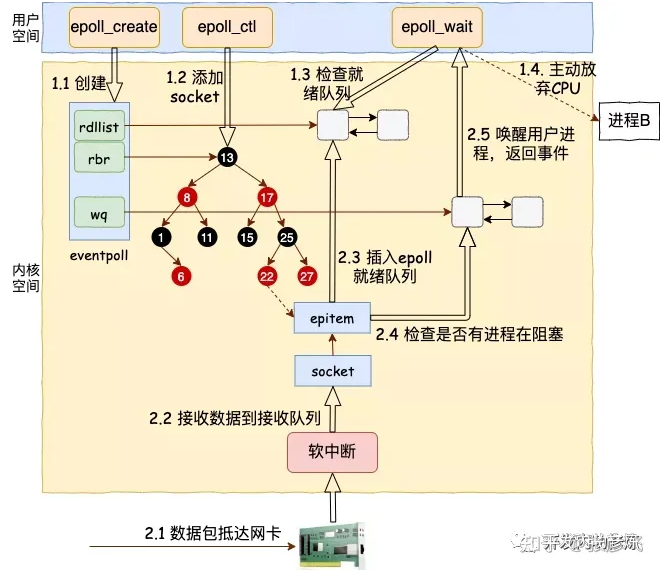

# 操作系统

## 进程管理

#### 基本系统调用接口

fork execv wait exit nanosleep vfork clone

#### 进程状态

+ 进程的创建

+ 进程的调度

+ 进程的阻塞

+ 进程陷入内核

+ 进程恢复用户态

+ 进程的摧毁

#### 进程与线程的区别

+ clone是如何创建线程（理解的关键）

+ 内核线程与用户线程

#### 调度算法

+ 先来先服务调度算法

+ 最短作业优先调度算法

+ 高响应比优先调度算法

+ 多级反馈队列调度算法

+ 时间片轮转调度算法

+ cfs调度算法（vtime决定调度时机，weight决定运行时间）

#### 并行与并发

#### 进程通信

##### 管道

pipe

##### 消息队列

msgget、msgsnd、msgrcv、msgctl

##### 共享内存

shmget、shmat、shmdt、shmctl

##### 信号量

semget、semop、semctl

#### 信号

信号处理的时机，是进程陷入内核，从内核态返回时检查处理

##### 相关系统调用

sigaction sigreturn sigprocmask kill

#### 同步与互斥

##### 类型

+ 锁

+ 信号量

+ 条件变量

##### 系统调用

为了避免进程进入临界区检查是否能够获取锁，需要陷入内核造成不必要开销而设立的系统调用 

futex

#### 死锁

##### 产生条件

##### 解决

## 内存管理

#### 核心系统调用接口

brk mmap munmap 

#### 物理内存分配与回收

##### 伙伴分配系统

##### vmalloc

##### kmalloc（slab）

#### 虚拟内存

+ 软件：多级页表

+ 硬件：MMU TLB 页表寄存器

+ SWAP

+ LAZY

#### 进程地址空间

.test

.rodata

.data

.bss

heap

mmap_area

stack

## 文件管理

#### 系统调用

open read write close mkdir chdir rename lseek link unlink symlink dup sync

#### 文件系统结构

+ 超级块

+ 位图

+ 索引节点

+ 数据块

## IO管理

#### VFS虚拟文件系统

linux下一切皆文件，linux一共有7种类型的文件，下面除非特别提到原意，否则文件指的都是vfs层的文件

+ 普通文件

+ 目录文件

+ 块设备文件

+ 字符设备文件

+ 套接字文件

+ 管道文件

+ 链接文件

file结构体（进程级别） inode结构体（内核级别）

#### IO模型

##### 阻塞IO

##### 非阻塞IO

##### 多路复用IO

##### 信号驱动IO

内核的poll函数

+ SELECT

+ POLL

+ EPOLL: 水平触发与边缘触发  惊群效应

##### 异步IO

io_uring_setup io_uring_enter io_uring_register

+ SQ与CQ

+ 提交与收割

  IOPOLL：内核线程轮询IO设备

  SQPOLL：内核线程轮询请求队列

#### 设备管理

ioctl

#### 网络

##### 系统调用

socket bind listen accept connect receive send shutdown

##### 套接字关联

+ tcp已连接套接字，tcplisten套接字

+ 套接字半连接队列

+ 套接字全连接队列

#### 零拷贝

##### read + write

##### mmap + write

##### sendfile

